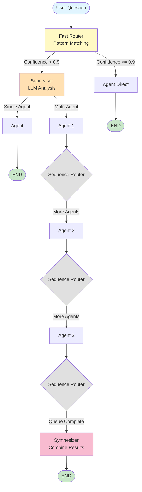
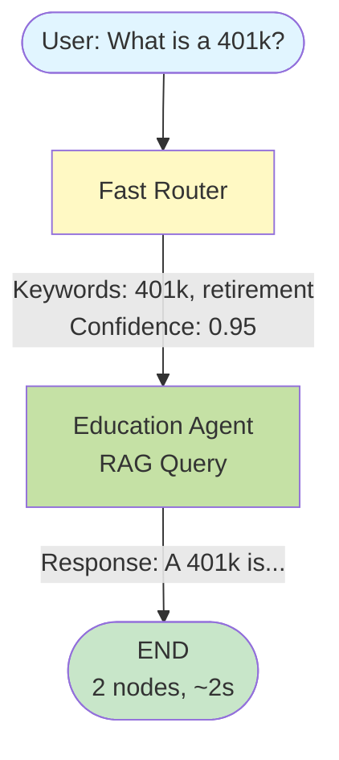
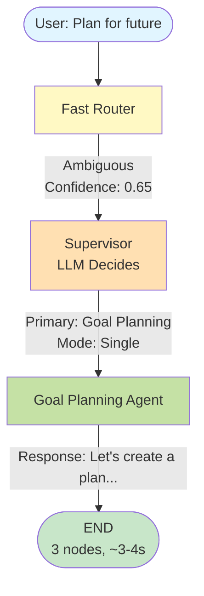
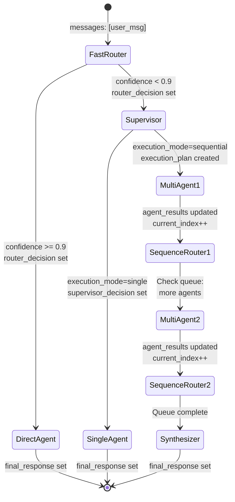
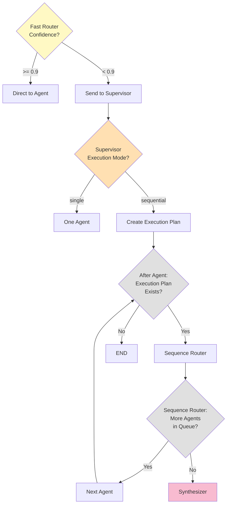
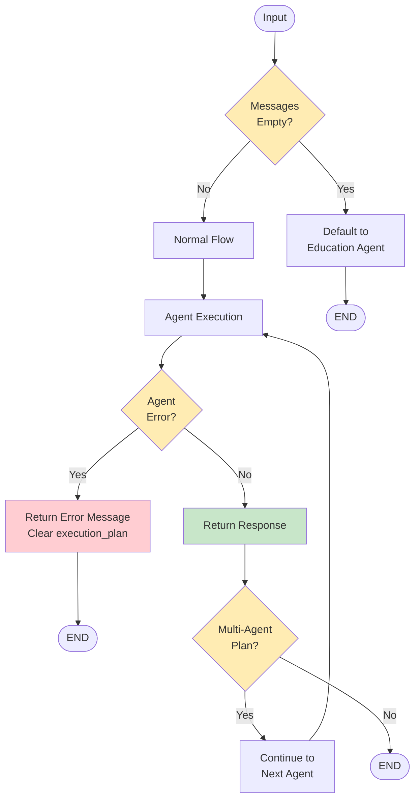
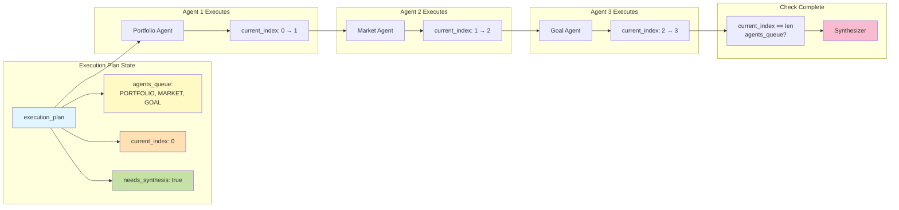
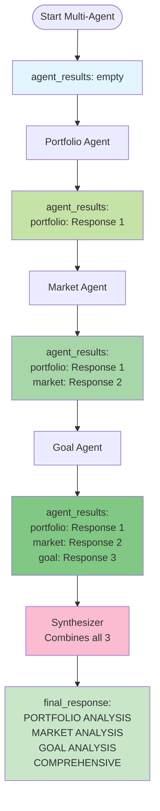
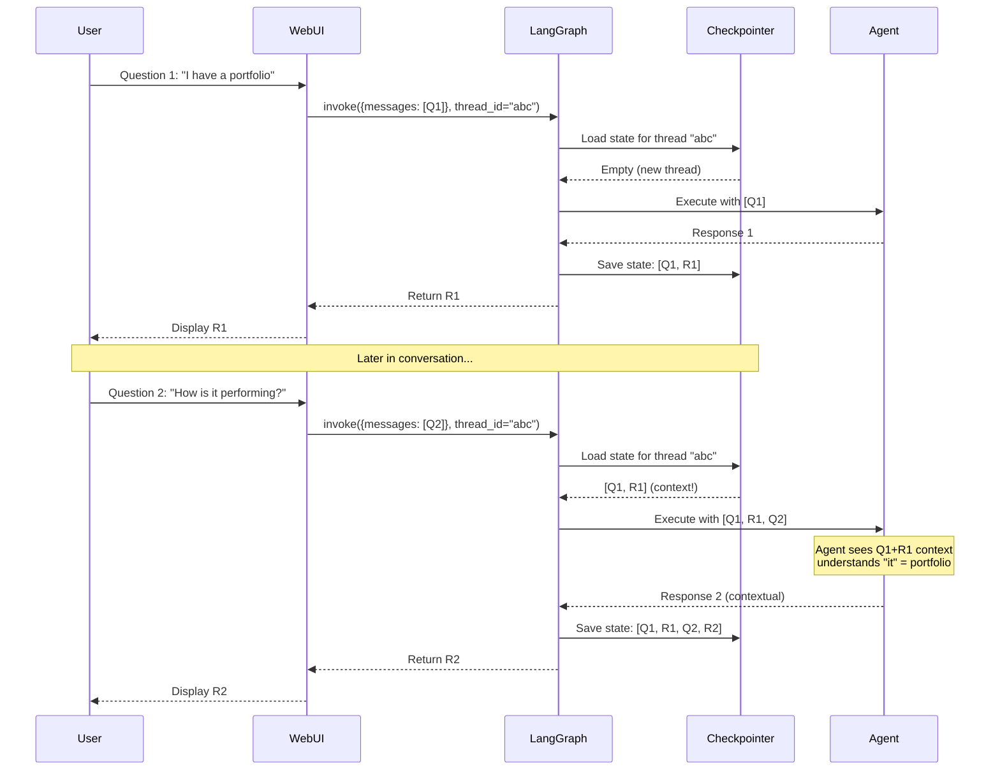

# Interactive Flow Diagrams

## How to View These Diagrams

1. Copy any diagram below
2. Go to https://mermaid.live/
3. Paste the code
4. View the interactive diagram!

---

## Diagram 1: Complete System Flow

---

## Diagram 2: Scenario - High Confidence Single Agent

**Example: "What is a 401k?"**

---

## Diagram 3: Scenario - Low Confidence Single Agent

**Example: "I want to plan something for my future"**

---

## Diagram 4: Scenario - Multi-Agent Sequential (3 Agents)

**Example: "Should I invest in Tesla? Consider my portfolio."**

```mermaid
graph TD
    START([User: Should I invest<br/>in Tesla? Consider<br/>my portfolio]) --> FAST_ROUTER[Fast Router]

    FAST_ROUTER -->|Complex Query<br/>Confidence: 0.45| SUPERVISOR[Supervisor]

    SUPERVISOR -->|Plan: Portfolio → Market → Goal<br/>Mode: Sequential| PORT_AGENT[Portfolio Agent<br/>Analyze current holdings]

    PORT_AGENT -->|Results: 60% tech stocks...| SEQ1{Sequence Router}

    SEQ1 -->|Index: 0→1<br/>Next: Market| MARKET_AGENT[Market Agent<br/>Analyze Tesla stock]

    MARKET_AGENT -->|Results: Tesla at $250...| SEQ2{Sequence Router}

    SEQ2 -->|Index: 1→2<br/>Next: Goal Planning| GOAL_AGENT[Goal Planning Agent<br/>Make recommendation]

    GOAL_AGENT -->|Results: Based on analysis...| SEQ3{Sequence Router}

    SEQ3 -->|Index: 2→3<br/>Queue Complete| SYNTH[Synthesizer<br/>Combine 3 Results]

    SYNTH -->|Final: PORTFOLIO + MARKET + GOAL| END([END<br/>10 nodes, ~8-12s])

    style START fill:#e1f5ff
    style FAST_ROUTER fill:#fff9c4
    style SUPERVISOR fill:#ffe0b2
    style PORT_AGENT fill:#c5e1a5
    style MARKET_AGENT fill:#c5e1a5
    style GOAL_AGENT fill:#c5e1a5
    style SEQ1 fill:#e0e0e0
    style SEQ2 fill:#e0e0e0
    style SEQ3 fill:#e0e0e0
    style SYNTH fill:#f8bbd0
    style END fill:#c8e6c9
```

---

## Diagram 5: State Transitions

---

## Diagram 6: Decision Points

---

## Diagram 7: Edge Cases Flow

---

## Diagram 8: Execution Plan Structure

---

## Diagram 9: Agent Results Accumulation

---

## Diagram 10: Conversation Memory Flow

---

## How to Use These Diagrams

### View Online
1. Visit https://mermaid.live/
2. Copy any diagram code above
3. Paste and view interactively
4. Can export as PNG/SVG

### View in VS Code
1. Install "Markdown Preview Mermaid Support" extension
2. Open this file
3. Use "Markdown: Open Preview" command
4. Diagrams render inline

### View in GitHub
- Mermaid diagrams render automatically in GitHub markdown

---

**Created:** 2026-01-17
**Tool:** Mermaid.js
**Total Diagrams:** 10
