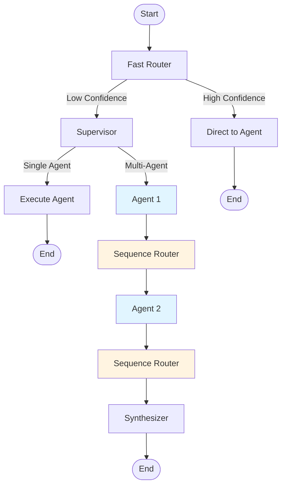

# LangGraph Multi-Agent Implementation

## Overview

The AI Finance Assistant now uses **LangGraph StateGraph** for multi-agent orchestration. This provides a robust, production-ready architecture with built-in state management, persistence, and workflow visualization.

## Architecture

### Graph Structure



### Components

#### 1. **Nodes** (`src/orchestration/nodes.py`)

Each node is a function that takes state and returns updated state:

- **fast_router_node** - Pattern/keyword-based routing (fast path)
- **supervisor_node** - LLM-based routing (ambiguous questions)
- **education_agent_node** - General financial education (RAG)
- **goal_planning_agent_node** - Financial goal planning
- **portfolio_agent_node** - Portfolio analysis
- **market_agent_node** - Market analysis
- **news_agent_node** - Investment research
- **sequence_router_node** - Lightweight routing between agents (no business logic)
- **synthesizer_node** - Combines multi-agent results

**Evolution:**
- **Phase 1:** Had `multi_agent_orchestrator_node` (imperative loops)
- **Phase 2:** Removed orchestrator, let agents route to each other (complex 35+ edges)
- **Phase 2.1 (Current):** Added `sequence_router` for clean linear flow (~15 edges)

#### 2. **State** (`src/orchestration/types.py`)

```python
class ExecutionPlan(TypedDict):
    agents_queue: List[AgentType]     # Ordered list of agents to execute
    current_index: int                # Current position in queue
    needs_synthesis: bool             # Whether to synthesize at end

class FinancialAssistantState(TypedDict):
    messages: List[Dict]              # Conversation history
    router_decision: RouterDecision   # Fast router output
    supervisor_decision: SupervisorDecision  # Supervisor output
    user_context: UserContext         # User profile
    agent_results: AgentResults       # Results from each agent
    current_agent: str                # Current agent
    agents_completed: List[str]       # Completed agents
    execution_plan: ExecutionPlan     # Sequential execution tracking (NEW)
    final_response: str               # Final response
```

#### 3. **Graph** (`src/orchestration/graph.py`)

StateGraph that assembles all nodes into a workflow:

```python
from src.orchestration import create_financial_assistant_graph

app = create_financial_assistant_graph()
result = app.invoke({"messages": [...]})
```

## Key Features

### 1. **Built-in State Management**

LangGraph automatically manages state passing between nodes:

```python
# State flows automatically through the graph
# No manual dictionary passing needed
def fast_router_node(state: FinancialAssistantState) -> Dict:
    # Update state
    return {
        **state,
        "router_decision": decision,
    }
```

### 2. **State Persistence**

Conversations persist across sessions using checkpointing:

```python
from langgraph.checkpoint.memory import MemorySaver
from src.orchestration import create_financial_assistant_graph

# Create app with memory
memory = MemorySaver()
app = create_financial_assistant_graph(checkpointer=memory)

# Use thread_id for persistence
config = {"configurable": {"thread_id": "user_123"}}

# First conversation
result1 = app.invoke({...}, config)

# Second conversation - remembers context
result2 = app.invoke({...}, config)
```

### 3. **Streaming**

Stream intermediate results as each node executes:

```python
for chunk in app.stream({"messages": [...]}, stream_mode="updates"):
    for node_name, state_update in chunk.items():
        print(f"Executing: {node_name}")
        print(f"State: {state_update}")
```

### 4. **Visualization**

Visualize the graph structure:

```python
from src.orchestration import visualize_graph

visualize_graph()  # Generates mermaid diagram
```

### 5. **Conditional Routing**

Smart routing between nodes based on state:

```python
def route_after_fast_router(state):
    if state["router_decision"].route == "direct":
        return f"{state['router_decision'].agent.value}_agent"
    else:
        return "supervisor"

workflow.add_conditional_edges(
    "fast_router",
    route_after_fast_router,
    {...}
)
```

### 6. **Sequential Multi-Agent Execution (SIMPLIFIED Pattern)**

We use a **sequence_router node** for clean, linear multi-agent execution:

#### The Problem We Solved:

**Version 2.0 (Complex):** Each agent could route to any other agent
- Result: 5 agents × 7 destinations = **35+ edges** 😱
- Graph became a complex mesh, hard to visualize

**Version 2.1 (Simple):** Added lightweight sequence_router node
- Result: ~**15 edges** in clean linear flow ✅
- Graph is easy to understand and visualize

#### How It Works:

1. **Supervisor creates execution plan** (when multi-agent needed):
```python
execution_plan = {
    "agents_queue": [AgentType.MARKET, AgentType.NEWS],
    "current_index": 0,
    "needs_synthesis": True
}
```

2. **Each agent advances the plan** and routes to sequence_router OR end:
```python
def _execute_agent_node(state, agent_type, agent_func):
    # Execute agent...

    # Advance execution plan
    if execution_plan := state.get("execution_plan"):
        execution_plan["current_index"] += 1

    return {..., "execution_plan": execution_plan}

def route_after_agent(state):
    # Simple 2-way choice
    if state.get("execution_plan"):
        return "sequence_router"  # Multi-agent scenario
    return "end"  # Single-agent scenario
```

3. **Sequence router node** (lightweight, no business logic):
```python
def sequence_router_node(state):
    # Just pass through - routing is done by conditional edge
    return state
```

4. **Sequence routing determines next agent**:
```python
def route_sequence(state):
    execution_plan = state["execution_plan"]
    agents_queue = execution_plan["agents_queue"]
    current_index = execution_plan["current_index"]

    if current_index < len(agents_queue):
        next_agent = agents_queue[current_index]
        return f"{next_agent.value}_agent"
    else:
        return "synthesize"
```

5. **Graph structure is clean and linear**:
```python
# Agents have simple 2-way routing
workflow.add_conditional_edges("market_agent", route_after_agent, {
    "sequence_router": "sequence_router",
    "end": END,
})

# Sequence router routes to next agent or synthesizer
workflow.add_conditional_edges("sequence_router", route_sequence, {
    "education_agent": "education_agent",
    "market_agent": "market_agent",
    "news_agent": "news_agent",
    "synthesize": "synthesizer",
})
```

#### Benefits of This Pattern:

- ✅ **Simple graph** - Linear flow, easy to visualize (vs 35+ edge mesh)
- ✅ **Separation of concerns** - Agents do work, router does routing
- ✅ **Declarative** - No imperative loops
- ✅ **Clean visualization** - Agent → Router → Agent → Router → Synthesizer
- ✅ **State-driven** - Execution controlled by state
- ✅ **Debuggable** - Can see exact linear path through graph

## Usage

### Basic Usage

```python
from src.orchestration import create_app_with_memory

app = create_app_with_memory()

result = app.invoke({
    "messages": [{"role": "user", "content": "How is my portfolio?"}],
    "user_context": {},
    "agent_results": {},
    "agents_completed": [],
})

print(result["final_response"])
```

### Using main_langgraph.py

**Single Question:**
```bash
python main_langgraph.py "How is my portfolio performing?"
```

**Interactive Mode:**
```bash
python main_langgraph.py
```

Commands in interactive mode:
- `/help` - Show available agents
- `/state` - Show current conversation state
- `/clear` - Start new conversation thread
- `/graph` - Visualize workflow graph
- `/exit` - Exit

### With Thread Persistence

```python
from src.orchestration import create_app_with_memory

app = create_app_with_memory()
config = {"configurable": {"thread_id": "user_123"}}

# Conversation 1
result1 = app.invoke(
    {"messages": [{"role": "user", "content": "I have a portfolio"}]},
    config
)

# Conversation 2 - remembers previous context
result2 = app.invoke(
    {"messages": result1["messages"] + [
        {"role": "user", "content": "How is it doing?"}
    ]},
    config
)
```

## Comparison: Old vs New

### Old Approach (main.py)

```python
# Manual orchestration
def ask_assistant(question, context):
    router_decision = fast_route(question)

    if router_decision.route == "direct":
        return AGENT_DISPATCHER[agent_type](question)
    else:
        supervisor_decision = supervisor_route(question)
        return _execute_sequential(...)  # Manual loop
```

**Issues:**
- ❌ Manual state management (dictionaries)
- ❌ No persistence
- ❌ Hard to visualize
- ❌ Limited error handling
- ❌ Manual multi-agent orchestration

### New Approach (main_langgraph.py)

```python
# LangGraph orchestration
from src.orchestration import create_app_with_memory

app = create_app_with_memory()
result = app.invoke({"messages": [...]}, config)
```

**Benefits:**
- ✅ Automatic state management
- ✅ Built-in persistence
- ✅ Visual graph representation
- ✅ Robust error handling
- ✅ Declarative workflow
- ✅ Streaming support
- ✅ Checkpointing
- ✅ Easy to extend

## Graph Statistics

- **Nodes:** 11 (including START and END)
  - 1 fast_router
  - 1 supervisor
  - 5 specialized agents
  - 1 sequence_router (lightweight routing node)
  - 1 synthesizer

- **Edges:** ~15 edges (clean linear flow)
  - 6 from fast_router (to supervisor or 5 agents)
  - 5 from supervisor (to 5 agents)
  - 5 × 2 = 10 from agents (to sequence_router or END)
  - 6 from sequence_router (to 5 agents or synthesizer)
  - 1 from synthesizer to END

**Evolution:**
- **v1.0:** Had `multi_agent_orchestrator` with imperative loops
- **v2.0:** Removed orchestrator, agents routed to each other (35+ edges)
- **v2.1 (Current):** Added `sequence_router` for clean linear flow (15 edges) ✅

## Testing

### Structure Test

```bash
python test_langgraph.py
```

This tests:
- Graph creation
- Node existence
- Graph visualization
- Simple routing (dry run)
- State persistence
- Streaming

### Quick Test

```python
from src.orchestration import create_financial_assistant_graph

app = create_financial_assistant_graph()
print(f"Nodes: {len(app.get_graph().nodes)}")
print(f"Edges: {len(app.get_graph().edges)}")
```

Expected output:
```
Nodes: 11
Edges: ~15 (clean linear flow)
```

## Migration Path

### Phase 1 (Completed) - Basic LangGraph
- ✅ StateGraph workflow
- ✅ Node-based architecture
- ✅ State management
- ✅ In-memory persistence

### Phase 2 (Completed) - Native LangGraph Patterns
- ✅ Removed orchestrator node
- ✅ Sequential execution via conditional routing
- ✅ Execution plan in state
- ✅ Declarative workflow (no imperative loops)
- ✅ **SIMPLIFIED:** Added sequence_router for clean linear flow (v2.1)

### Phase 3 (Next) - Advanced Features
- ⏳ SqliteSaver for persistent storage
- ⏳ Human-in-the-loop nodes
- ⏳ True async parallel execution (Send API)
- ⏳ LLM-based result synthesis
- ⏳ Error retry logic

### Phase 3 (Future) - Production Features
- ⏳ Monitoring and logging
- ⏳ A/B testing different workflows
- ⏳ Performance optimization
- ⏳ Advanced visualizations (LangGraph Studio)

## Files Modified/Created

### Phase 1 (Initial LangGraph Implementation)
```
src/orchestration/
├── __init__.py           # Updated with LangGraph exports
├── types.py              # Added FinancialAssistantState
├── router.py             # Fast router (existing)
├── supervisor.py         # Supervisor (existing)
├── nodes.py              # NEW: LangGraph node implementations
└── graph.py              # NEW: StateGraph workflow definition

main_langgraph.py         # NEW: LangGraph-based entry point
test_langgraph.py         # NEW: LangGraph test suite
```

### Phase 2 (Native LangGraph Patterns Refactoring)
```
src/orchestration/
├── types.py              # UPDATED: Added ExecutionPlan type
├── nodes.py              # UPDATED: Removed orchestrator, added sequential routing
└── graph.py              # UPDATED: Removed orchestrator node, updated edges

main_langgraph.py         # UPDATED: Removed orchestrator progress display
test_langgraph.py         # UPDATED: Removed orchestrator from expected nodes
LANGGRAPH_IMPLEMENTATION.md  # UPDATED: Documented new pattern
```

## Next Steps

1. **Test with real questions** - Run `python main_langgraph.py`
2. **Explore state persistence** - Test `/state` command in interactive mode
3. **Visualize the graph** - Use `/graph` command or paste mermaid into https://mermaid.live/
4. **Add SqliteSaver** - For persistent storage across restarts
5. **Implement human-in-the-loop** - For approval of expensive operations
6. **Add streaming to UI** - Show progress as nodes execute

## Benefits Realized

1. **Declarative Workflow** - Easy to understand and modify
2. **Built-in Features** - Persistence, streaming, checkpointing
3. **Production Ready** - Robust error handling and state management
4. **Extensible** - Easy to add new nodes and edges
5. **Debuggable** - Visual representation and state inspection
6. **Scalable** - Handles complex multi-agent workflows

## Resources

- [LangGraph Documentation](https://python.langchain.com/docs/langgraph)
- [Mermaid Live Editor](https://mermaid.live/) - Visualize graph diagrams
- [LangGraph Studio](https://github.com/langchain-ai/langgraph-studio) - Visual debugging tool

---

**Status:** ✅ Phase 2.1 Complete - SIMPLIFIED Architecture
**Version:** 2.1.0
**Date:** 2026-01-16

## Changelog

### v2.1.0 (2026-01-16) - SIMPLIFIED Graph Architecture ⭐
- ✅ **Added `sequence_router` node** - Lightweight routing between agents
- ✅ **Simplified routing functions** - `route_after_agent` and `route_sequence`
- ✅ **Reduced complexity** - From 35+ edges to ~15 edges
- ✅ **Clean linear flow** - Agent → Router → Agent → Router → Synthesizer
- ✅ **Better visualization** - Easy to understand graph structure
- ✅ **Separation of concerns** - Agents do work, router does routing

**Problem Solved:** v2.0 had every agent routing to every other agent (complex mesh).
v2.1 adds a simple router node for clean linear flow.

### v2.0.0 (2026-01-16) - Native LangGraph Patterns
- ✅ Removed `multi_agent_orchestrator` node
- ✅ Implemented sequential execution using conditional routing
- ✅ Added `ExecutionPlan` type for state-based execution tracking
- ✅ Updated `supervisor_node` to initialize execution plans
- ✅ Updated `_execute_agent_node` to advance execution plan
- ✅ Fully declarative workflow (no imperative loops)
- ⚠️ **Issue:** Complex graph with 35+ edges (agent-to-agent mesh)

### v1.0.0 (2026-01-16) - Initial LangGraph Implementation
- ✅ Created LangGraph StateGraph workflow
- ✅ Implemented all agent nodes
- ✅ Added fast router and supervisor nodes
- ✅ Implemented synthesizer node
- ✅ Added state management and persistence
- ✅ Created main entry point and tests
- ⚠️ **Issue:** Used orchestrator node with imperative loops
